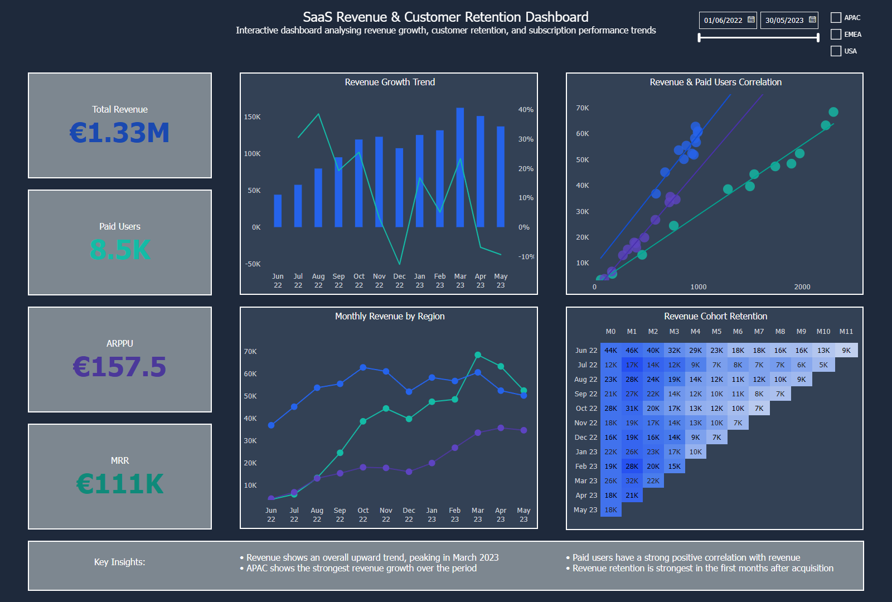

# SaaS Revenue & Customer Retention Dashboard

## Project Overview

This project analyzes SaaS subscription revenue, customer behavior, and retention trends using Power BI.

The dashboard helps understand revenue performance, customer growth, regional differences, and long-term customer value through cohort analysis.

The same business case was also developed in Tableau to compare dashboard development workflows across different BI tools.

---

## Dashboard Preview

---

## Key Metrics

- Total Revenue
- Monthly Recurring Revenue (MRR)
- Paid Users
- Average Revenue Per Paying User (ARPPU)
- Revenue Growth %
- Revenue Cohort Retention

---

## Dashboard Features

- Interactive date and location filters
- Revenue trend analysis
- Regional revenue comparison
- Revenue and paid user correlation analysis
- Customer cohort retention heatmap

---

## Tools & Skills

- Power BI
- Power Query
- DAX
- Data Modeling
- Calendar Table
- Conditional Formatting
- Data Visualization

---

## Data Model

The Power BI version includes:

- Date dimension table
- One-to-many relationship model
- DAX measures for business KPIs
- Cohort calculations using DAX

---

## Key Insights

- Revenue showed consistent growth during the analyzed period.
- APAC demonstrated strong revenue expansion.
- Paid users and revenue showed a positive correlation.
- Cohort analysis helped identify customer revenue retention patterns.

---

## Files

- `.pbix` - Power BI dashboard file
- `.csv` - dataset
- `.png` - dashboard preview image
